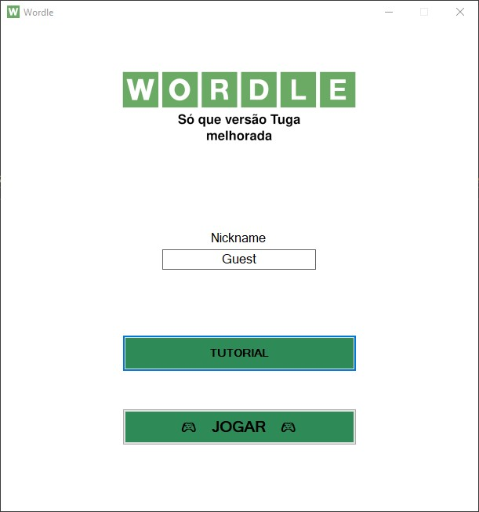
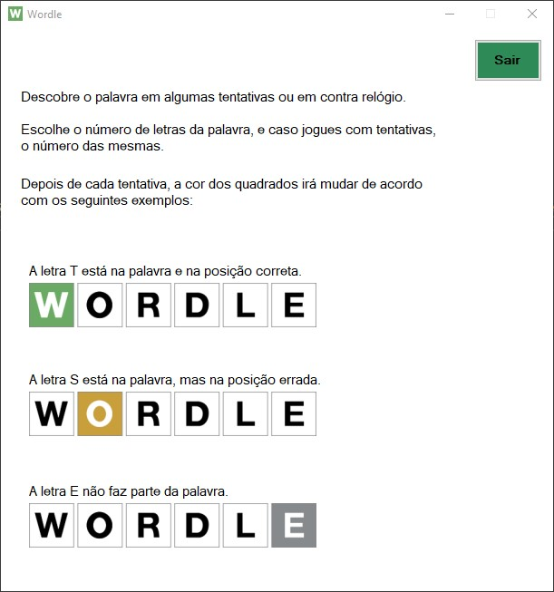
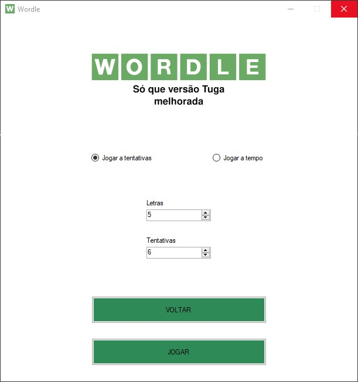
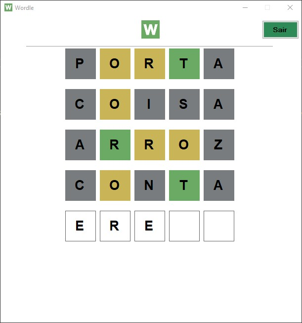

<h1 align="center">
	
</h1>

This game is the final project created to a subject at my High School. `Wordle Tuga` is a portuguese version of [`Wordle`](https://www.nytimes.com/games/wordle/index.html) game.

###### Technologies used: `C#` & `Windows Forms`

	
	
	
	

